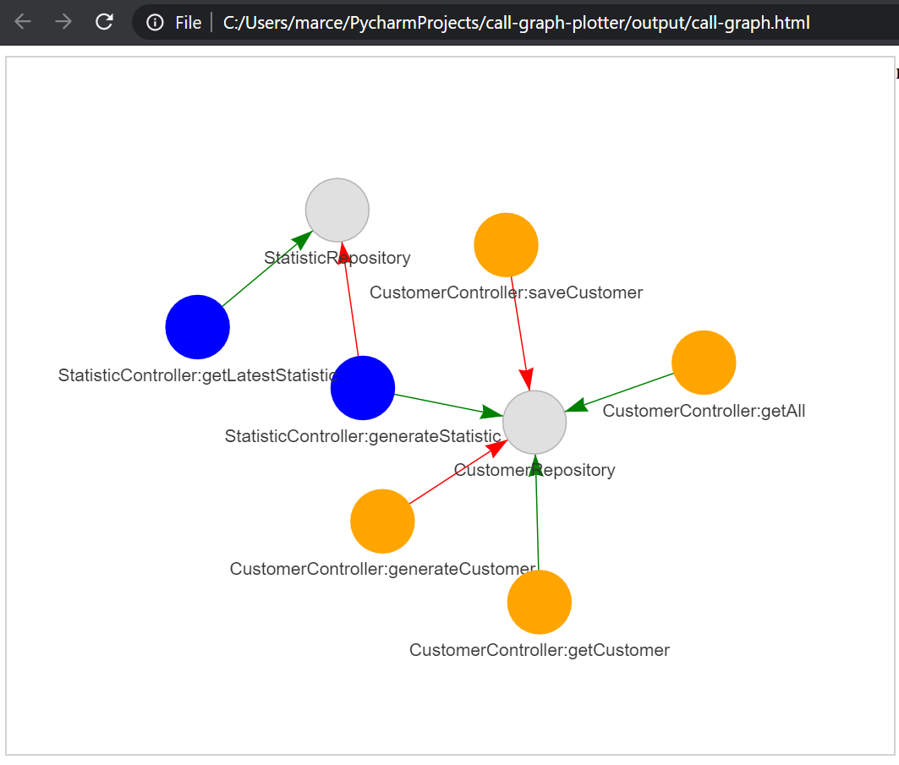

# Java Call Graph Plotter

This project allows to generate and visualize static call graphs for Spring/Java applications.

# Installation

After cloning the repository, create a Python 3.8 virtual environment in the project folder:
```bash
python -m venv venv
```
Activate the virtual environment and install the dependencies:
```bash
source venv/activate
pip install -r requirements.txt
```

# Usage

Create a call graph from your Jar:
```
java -jar javacg/javacg-0.1-SNAPSHOT-static.jar <yourjar>.jar > call-graph.txt
```
If you just want to test how it works, you can use the example jar in the folder *target-jar*:
```
java -jar javacg/javacg-0.1-SNAPSHOT-static.jar target-jar/demo-customer-0.0.1-SNAPSHOT.jar > call-graph.txt
```
Now create the graph by running:
```
python call-graph-plotter.py call-graph.txt
```
A new graph will be created in the folder *output*. It's a html file so you can open it in the browser.
If you used the example jar, this is what you should see in the browser:


